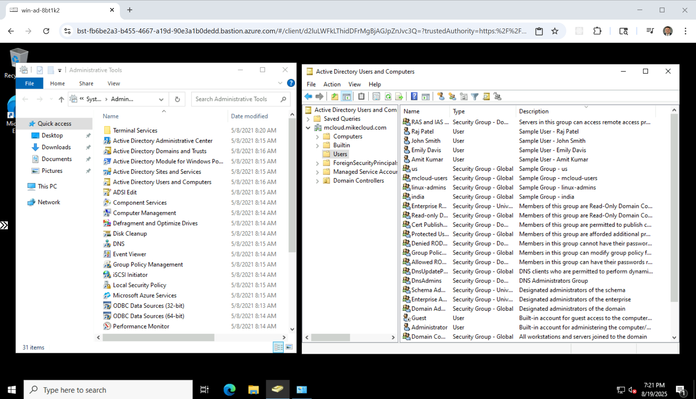

# Azure Entra Domain Services (Azure AD DS)

This is Part 2 of the Series: [Deploying Active Directory in the Cloud](https://youtu.be/H5lKJPJBL5s)

## Introduction  

In this video, we will demonstrate the deployment of **Azure Entra Domain Services (Azure AD DS)**, a fully managed **Active Directory** solution in Azure, while covering the following tasks:  

- **Configure secure networking** by setting up subnets, Network Security Groups (NSGs), and private DNS to ensure seamless domain connectivity. 
- **Deploy Azure AD Domain Services** within an Azure Virtual Network (VNet) to support domain-joined workloads.  
- **Join both Windows and Linux servers** to the Active Directory domain.  
- **Manage directory objects and policies**, including users, groups, and Organizational Units (OUs).  
- **Integrate with Azure Key Vault** to securely store and retrieve administrator credentials.  
- **Configure SSSD** ([System Security Services Daemon](https://sssd.io/)) for Linux authentication with Active Directory.  
- **Clean up resources** by decommissioning all infrastructure provisioned during the process.  

This tutorial will help you understand **Azure AD Domain Services** and how to use it for **identity management in Azure environments**.


## Prerequisites

* [An Azure Account](https://portal.azure.com/)
* [Install AZ CLI](https://learn.microsoft.com/en-us/cli/azure/install-azure-cli) 
* [Install Latest Terraform](https://developer.hashicorp.com/terraform/install)
* [Microsoft.AAD](https://learn.microsoft.com/en-us/azure/role-based-access-control/permissions/identity#microsoftaad) Provider must be enabled
* `Global Administrator` **Entra ID** role must be assigned to build identity

If this is your first time watching our content, we recommend starting with this video: [Azure + Terraform: Easy Setup](https://www.youtube.com/watch?v=wwi3kVgYNOk). It provides a step-by-step guide to properly configure Terraform, Packer, and the AZ CLI.

## Download this Repository

```bash
git clone https://github.com/mamonaco1973/azure-directory.git
cd azure-directory
```

## Build the Code

Run [check_env](check_env.sh) then run [apply](apply.sh).

```bash
develop-vm:~/azure-directory$ ./apply.sh
NOTE: Validating that required commands are found in your PATH.
NOTE: az is found in the current PATH.
NOTE: terraform is found in the current PATH.
NOTE: All required commands are available.
NOTE: Validating that required environment variables are set.
NOTE: ARM_CLIENT_ID is set.
NOTE: ARM_CLIENT_SECRET is set.
NOTE: ARM_SUBSCRIPTION_ID is set.
NOTE: ARM_TENANT_ID is set.
NOTE: All required environment variables are set.
NOTE: Logging in to Azure using Service Principal...
NOTE: Successfully logged into Azure.
NOTE: 'User Administrator' entra role is assigned to current service principal.
NOTE: Validating AADS service prinicipal '2565bd9d-da50-47d4-8b85-4c97f669dc36'
NOTE: Microsoft.AAD is currently registered!
NOTE: Default domain for account is mamonaco1973gmail.onmicrosoft.com
Initializing the backend...
Initializing provider plugins...
- Finding latest version of hashicorp/random...
- Finding latest version of hashicorp/azurerm...
- Installing hashicorp/random v3.7.1...
- Installed hashicorp/random v3.7.1 (signed by HashiCorp)
- Installing hashicorp/azurerm v4.22.0...
- Installed hashicorp/azurerm v4.22.0 (signed by HashiCorp)
Terraform has created a lock file .terraform.lock.hcl to record the provider
selections it made above. Include this file in your version control repository
so that Terraform can guarantee to make the same selections by default when
you run "terraform init" in the future.

Terraform has been successfully initialized!
[...]
```

### Build Process Overview  

The build process consists of two phases:  

1. **Phase 1:** Use Terraform to provision the required networking and deploy the Azure Active Directory Domain Services instance. This phase takes approximately **60-90 minutes** to complete.  
2. **Phase 2:** Once the directory service is provisioned, deploy a Linux and a Windows VM instance. Their respective **custom data scripts** will automatically join them to the domain during initialization.  

## Tour of Build Output in the Azure Console

- **ad-resource-group** Resource Group
- **Networking**
- **The Domain Services Instance**
- **Key Vault**
- **The Windows VM Instance**
- **The Linux VM Instance**


### Retrieving Initial Admin Credentials

After your **Domain Services** instance is provisioned, **administrative access to the managed domain** works differently compared to traditional Active Directory.

Microsoft Entra Domain Services does not automatically create an initial administrator user. Instead, the process works as follows:

1. **Create a group named `AAD DC Administrators`** within your **Microsoft Entra ID** (formerly Azure AD) tenant. This group grants its members administrative permissions within the managed domain.
2. **Create a user account** in Entra ID (this will act as the domain admin account for the managed domain).
3. **Add the user account to the `AAD DC Administrators` group**.
4. **Wait for directory synchronization to complete** (this can take up to 30 minutes). After synchronization, the user will have administrative rights inside the managed domain.

In this solution, we **automate all these steps** using **Terraform and Azure CLI scripts**. The **admin credentials** for the newly created user are securely stored in **Azure Key Vault** as a secret named `admin_ad_credentials`. This allows other automation steps — such as joining servers to the domain — to retrieve the credentials securely.

### Users and Groups

As part of this project, when the Windows instance boots and successfully joins Active Directory, a set of **users** and **groups** are automatically created through a scripted process. These resources are intended for **testing and demonstration purposes**, showcasing how to automate user and group provisioning in a cloud-integrated Active Directory environment.

#### Groups Created

| Group Name    | Group Category | Group Scope | gidNumber |
|----------------|----------------|----------------|------------|
| mcloud-users   | Security       | Universal     | 10001 |
| india          | Security       | Universal     | 10002 |
| us             | Security       | Universal     | 10003 |
| linux-admins   | Security       | Universal     | 10004 |

#### Users Created and Group Memberships

| Username | Full Name   | uidNumber | gidNumber | Groups Joined                    |
|---------|------------|-----------|-----------|----------------------|
| jsmith  | John Smith  | 10001 | 10001 | mcloud-users, us, linux-admins |
| edavis  | Emily Davis | 10002 | 10001 | mcloud-users, us |
| rpatel  | Raj Patel   | 10003 | 10001 | mcloud-users, india, linux-admins |
| akumar  | Amit Kumar  | 10004 | 10001 | mcloud-users, india |

---


#### Understanding `uidNumber` and `gidNumber` for Linux Integration

The **`uidNumber`** (User ID) and **`gidNumber`** (Group ID) attributes are critical when integrating **Active Directory** with **Linux systems**, particularly in environments where **SSSD** ([System Security Services Daemon](https://sssd.io/)) or similar services are used for identity management. These attributes allow Linux hosts to recognize and map Active Directory users and groups into the **POSIX** (Portable Operating System Interface) user and group model.

### Log into Windows Instance  

After the Windows instance boots, the `azurerm_virtual_machine_extension`  executes [ad-join.ps script](02-servers/scripts/ad_join.ps1.template) which does the following tasks   

- Install Active Directory Administrative Tools  
- AWS CLI Installation  
- Join EC2 Instance to Active Directory  
- Create Active Directory Groups  
- Create Active Directory Users and Assign to Groups  
- Grant RDP Access  
- Final System Reboot  

Administrator credentials are stored in the `admin_ad_credentials` secret within the project's key vault.



### Log into Linux Instance  

When the Linux instance boots, the [custom data script](02-servers/scripts/custom_data.sh) runs the following tasks:  

- Update OS and install required packages  
- Install AWS CLI  
- Join the Active Directory domain with SSSD  
- Enable password authentication for AD users  
- Configure SSSD for AD integration  
- Grant sudo privileges to the `linux-admins` group  

Linux user credentials are stored as secrets.

 

## Run the "destroy" script when you are done

```bash
develop-vm:~/azure-directory$ ./destroy.sh
NOTE: Default domain for account is mamonaco1973gmail.onmicrosoft.com
NOTE: Key vault for secrets is ad-key-vault-tee8cual
Initializing the backend...
Initializing provider plugins...
- Reusing previous version of hashicorp/local from the dependency lock file
- Reusing previous version of hashicorp/azurerm from the dependency lock file
- Reusing previous version of hashicorp/random from the dependency lock file
- Reusing previous version of hashicorp/azuread from the dependency lock file
- Using previously-installed hashicorp/local v2.5.2
- Using previously-installed hashicorp/azurerm v4.22.0
- Using previously-installed hashicorp/random v3.7.1
- Using previously-installed hashicorp/azuread v3.1.0

Terraform has been successfully initialized!
[...]
```

